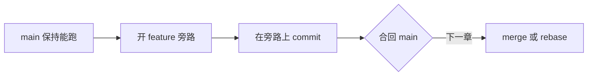
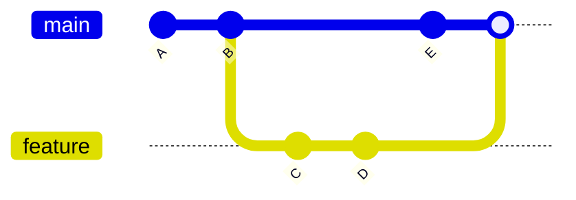
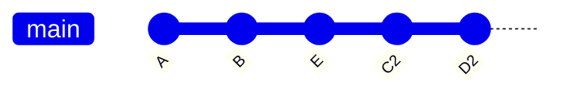

写博客、推 GitHub Pages、改 side project，都离不开 Git。我把它想成一条线：先搞清它在记什么，再学会每天怎么存、怎么跟远程同步；需要并行做事时才开分支；**合回去**才是 merge 和 rebase 出场的地方——它们回答的是同一件事，只是留下的历史不一样。

# 一、Git 在记什么

## 1. 工作区、暂存区、版本库

改文件时，Git 里大致有三层：

| 区域 | 是什么 | 常见命令 |
|------|--------|----------|
| 工作区 | 磁盘上正在改的文件 | `git status`、`git diff` |
| 暂存区 | 下次 commit 要带上的内容 | `git add`、`git restore --staged` |
| 版本库 | 已经记下的历史 | `git commit`、`git log` |

`git add` 只是把改动登记进暂存区；`git commit` 才写入本地历史。要让别人（或另一台电脑）拿到，还得 `git push`。


出问题时我通常先 `git status`，再 `git diff`，看改动停在哪一层。

# 二、把项目放进仓库

## 1. 本地新建

```bash title="初始化"
cd your-project
git init -b main
```

`-b main` 直接指定默认分支名。不写 `-b` 也能 init，默认名取决于 Git 版本和 `init.defaultBranch`，可能是 `main`，也可能是 `master`。想和 GitHub 现在的默认一致，就显式写上 `main`。

上面是「进入目录，再初始化」两步，不是在同一目录里 init 两次。

## 2. 克隆已有仓库

```bash title="第一次拿完整仓库"
git clone <远程仓库地址>
```

克隆下来通常已经配好 `origin`，当前分支也会跟踪远程同名分支。之后同步别人的更新用 `git pull`；推自己的 commit 用 `git push`。第一次推这个分支时，有时还要加 `-u` 才能建跟踪关系。

## 3. 本地目录后接远程

文件夹里已经有代码、还没建过 Git 时，顺序是：初始化 → 至少一次 commit → 加上远程 → 再推。空仓库没有 commit，`push` 会失败。

```bash title="已有代码接到 GitHub"
git init -b main
git add -A
git commit -m "init: 首次提交"
git remote add origin <远程仓库地址>
git remote -v
git push -u origin main
```

远程默认分支不叫 `main` 时，把最后一行的名字换成实际的，或本地先 `git branch -M main` 再推。  
`-u` 会记下「这个本地分支对应远程哪一条」，以后同一条路上可以只打 `git push`。地址写错了用 `git remote set-url origin <新地址>`。

## 4. 哪些文件不该进仓库

依赖、构建产物、本地密钥写进项目根目录的 `.gitignore`：

```txt title=".gitignore"
node_modules/
dist/
.env
.astro/
```

刚误 `add`、还没 commit 的：`git restore --staged <文件>`，再补规则。  
文件**已经进过某次 commit** 的话，只改 `.gitignore` 不会让它从历史上消失，还要 `git rm --cached <文件>`，再 commit 一次。

# 三、每天怎么提交

## 1. 从改文件到推远程

```bash title="日常循环"
git status
git add -A                    # 全部改动进暂存；或只 add 某文件：
# git add <文件路径>
git commit -m "feat: 说明"
git push origin <分支名>
```

`git add -A` 和 `git add <文件>` 二选一即可，不必两条都敲。说明我习惯用短前缀：`feat:` 新功能、`fix:` 修 bug、`docs:` 只改文档。一行写清做了什么就够。

某个 commit 值得当里程碑时再打标签：

```bash title="查看提交与打标签"
git show <commit-id>
git tag <tag-name>
git push origin <tag-name>
git push origin --tags
```

## 2. 提交前先看差异

```bash title="git diff"
git diff
git diff --cached
git diff <file>
git diff HEAD~1 HEAD
```

| 命令 | 比的是什么 |
|------|------------|
| `git diff` | 工作区 vs 暂存区（还没 add 的） |
| `git diff --cached` | 暂存区 vs 最后一次 commit |
| `git diff HEAD~1 HEAD` | 相邻两次 commit 之间 |

## 3. 拉取别人的更新

`git pull` 默认是 `git fetch` 再 **merge**：先把远程新提交下载下来，再并进当前分支。[^pull-default]

只想先看远程变了什么、工作区先不动：

```bash title="拆开 fetch 与合并"
git fetch origin
git merge origin/<分支名>
```

`fetch` 更新的是远程跟踪分支（例如 `origin/main`）。确认之后再 merge；若更想把历史接成一条直线，用 rebase——两种合回去的差别在第五章。

推本地 commit：

```bash
git push origin <分支名>
```

第一次推某条分支并建立跟踪：`git push -u origin <分支名>`。

# 四、用分支把工作隔开

## 1. 为什么要开分支

`main` 我希望随时能跑、随时能发。新功能或一次试验就开一条旁路，改砸了也不至于把正在线上的历史搅乱。分支本身只是「指向某次 commit 的指针」，开销很小。



## 2. 查看分支

日常用得最多的是「我在哪、有哪些分支」：

```bash title="查看"
git branch --show-current
git branch
git branch -a
git branch -r
```

| 命令 | 作用 |
|------|------|
| `git branch --show-current` | 当前分支名 |
| `git branch` | 本地分支列表 |
| `git branch -a` | 本地 + 远程跟踪分支 |
| `git branch -r` | 只看远程 |

## 3. 创建与切换

开旁路、切回去，通常就这两条：

```bash title="创建并切换"
git switch -c feature/xxx
git switch main
```

`git checkout -b feature/xxx` 是旧写法，和 `git switch -c` 做同一件事。`checkout` 还能用来恢复文件，和专门管切换的 `switch` 并不完全等同。

我常用的节奏：`git switch -c feature/xxx` → 改完并 commit → 再决定怎么合回 `main`（见第五章）。

## 4. 删除分支

本地删干净了，再考虑删远程：

```bash title="删除"
git branch -d feature/xxx
git branch -D feature/xxx
git push origin --delete feature/xxx
```

| 命令 | 说明 |
|------|------|
| `git branch -d` | 删除**已合并**的本地分支 |
| `git branch -D` | 强制删本地分支（未合并也会删） |
| `git push origin --delete` | 删远程分支 |

> [!TIP]
> 删之前用 `git branch --merged main` 看一眼哪些已经合进 `main`，少误删还在用的旁路。

# 五、把分支合回去

旁路上的工作最终要回到 `main`。Git 给了两条路：**merge** 留下分叉和一次合并提交；**rebase** 把你的提交挪到目标分支最新点之后，历史更像一条直线。选的是「历史长什么样」，不是「能不能把代码合进去」。

## 1. 同一件事，两种历史

假设 `main` 在你开发期间又多了一次提交 `E`，旁路上有 `C`、`D`：

**merge 之后**，分叉还在，多一个合并点：



**rebase 之后**，`C`、`D` 接到 `E` 后面（新提交，哈希会变；图里写成 `C2`、`D2`）：



> [!TIP]
> 公共分支、已经有人基于你的提交在做的：合回去用 merge，别 rebase 再 force push。已经 push 出去的某次错误提交，想撤掉时用第六章的 `revert`，不要靠改写历史。只有自己的功能分支、还没人跟、或明确约定可以 rebase 时，再用 rebase 把线捋直。

## 2. merge：保留分叉

先回到要**接收**改动的那条分支，再 merge 旁路：

```bash title="合回 main"
git switch main
git merge feature/xxx
git push origin main
```

若 `main` 没有在分叉后前进，Git 可能做**快进**：指针直接挪到旁路顶端，看起来像一条直线，不会多一次合并提交。  
`main` 上也有新提交时，会做出上图那种分叉 + 合并点。想**即使能快进也留下合并提交**（以后能看出「曾经有过这条分支」）：

```bash
git merge --no-ff feature/xxx
```

## 3. rebase：把提交接到最新后面

在**功能分支上**先跟上 `main`，再切回 `main` 做一次快进合并，是很常见的个人仓库写法：

```bash title="先 rebase 再合回"
git switch feature/xxx
git fetch origin
git rebase origin/main
git switch main
git merge feature/xxx
git push origin main
```

`git rebase origin/main` 的意思是：把当前分支上「相对 `origin/main` 多出来的那些 commit」摘下来，接到 `origin/main` 最新提交之后，一个一个重放。所以哈希会变，看起来像这些改动是在最新 `main` 上从头做的。

日常拉远程时也可以 `git pull --rebase`，用 rebase 代替 pull 默认的 merge，少一条「把远程并进来」的合并提交。和第五章开头那条原则一样：只适合你一个人在用的分支。

## 4. 冲突时两边怎么收场

两边改了同一处，Git 会在文件里标 `<<<<<<<` / `=======` / `>>>>>>>`。改到满意后：

| | merge | rebase |
|--|--------|--------|
| 记上解决结果 | `git add <文件>` | 同样 `git add <文件>` |
| 继续 | `git commit`（完成那次合并提交） | `git rebase --continue`（重放下一颗 commit） |
| 整段放弃 | `git merge --abort` | `git rebase --abort` |

merge 的冲突发生在「合成一个新提交」时，解决完通常就结束。rebase 可能在重放每一颗 commit 时各撞一次，所以是 `--continue`，不是再 `commit` 一次当合并节点。

> [!WARNING]
> 已经 push、别人可能基于它继续写的分支，不要 rebase 完再 force push。个人分支、还没 push 的 commit 才比较适合改写。

## 5. 用 log 看清合完之后的样子

```bash title="git log"
git log
git log --oneline -10
git log --oneline 分支A..分支B
git log --graph --all -5
git log --author="name"
git log -- <filename>
git log -p
```

`git log --graph --all` 能看见分叉还是一条线，正好对照前面两张图。  
`分支A..分支B` 列的是 **B 有、A 没有** 的提交。  
`git log -- <filename>` 里 `--` 和文件名之间要有空格，否则 Git 会把文件名当成选项。

# 六、改错与回退

按「改动停在哪一层」选命令：手头改了一半还没想 commit、已经 add 但还没 commit、已经 commit。三层别混用。

## 1. 手头改了一半：stash

要切分支，但当前改动还不想变成 commit：

```bash title="stash"
git stash
git stash push -u -m "说明"
git stash list
git stash pop
git stash apply
git stash drop
```

| 命令 | 作用 |
|------|------|
| `git stash` | 收起工作区里已跟踪文件的改动（含已暂存的） |
| `git stash push -u` | 连**尚未跟踪**的新文件一起收 |
| `git stash pop` | 恢复最近一条，并删掉这条记录 |
| `git stash apply` | 恢复但留着记录，可以再 apply 一次 |
| `git stash drop` | 只删记录，不往工作区倒 |

`pop` 若碰到冲突，那条 stash 有时不会自动删，用 `git stash list` 看一下再决定 `drop`。

## 2. 还没 commit：restore

`git restore` 管的是工作区和暂存区，**不改已经存在的 commit**。

```bash title="restore"
git restore <文件>
git restore .
git restore --staged <文件>
git restore --staged .
```

| 场景 | 命令 | 结果 |
|------|------|------|
| 丢掉工作区里未暂存的修改 | `git restore <文件>` | 文件回到最近一次 commit 的内容 |
| 丢掉全部未暂存修改 | `git restore .` | 工作区干净，暂存区不动 |
| 从暂存区拿下来，改动留在工作区 | `git restore --staged <文件>` | 相当于旧写法 `git reset HEAD <文件>` |
| 清空整个暂存区 | `git restore --staged .` | 改动仍在工作区 |

> [!WARNING]
> `git restore <文件>` 会丢掉还没 commit 的修改。执行前用 `git status` / `git diff` 看一眼。

## 3. 已经 commit：reset 与 revert

这是在动版本库里的指针，和 restore 不是一层。

```bash title="reset / revert"
git reset --soft HEAD~1
git reset --mixed HEAD~1
git reset --hard HEAD~1
git revert <commit-id>
git show HEAD~1
```

| 场景 | 命令 | 说明 |
|------|------|------|
| 撤销最近一次 commit，改动留在暂存区 | `git reset --soft HEAD~1` | 可以改完再 commit |
| 撤销最近一次 commit，改动回到工作区 | `git reset --mixed HEAD~1` | `reset` 不写模式时就是这个 |
| 撤销 commit，连改动一起丢掉 | `git reset --hard HEAD~1` | 本地很难救回来 |
| 公开历史上不要某次提交 | `git revert <commit-id>` | 新增一次「反向提交」，旧历史还在 |

已经推到大家共用的分支上，我优先 `revert`。`reset --hard` 只在确定不要那些改动、并且还没分享出去时用。

---

这个博客本身也是 commit 之后 push，Actions 再构建 Pages。本地 `npm run build` 过了再推，少踩发布失败的坑。命令手册更全的可以看 [Pro Git（中文版）](https://git-scm.com/book/zh/v2)。[^pro-git]

[^pull-default]: 现在常见的 Git 里，`pull.rebase` 若没改过，`git pull` 就是 fetch + merge。有人会改成 rebase，那 pull 的行为会跟第五章第 3 节一样，不再多一条合并提交。

[^pro-git]: 分支、合并与变基在书里是连着讲的，和这篇第五章的问题是同一类：[《Git 分支 - 变基》](https://git-scm.com/book/zh/v2/Git-%E5%88%86%E6%94%AF-%E5%8F%98%E5%9F%BA)。
