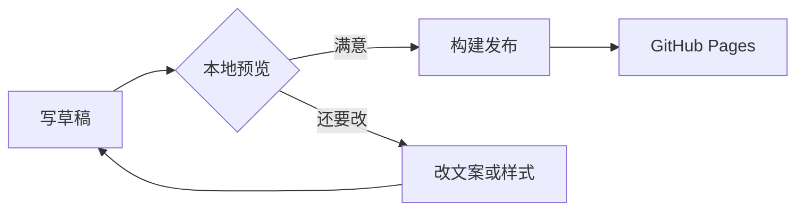
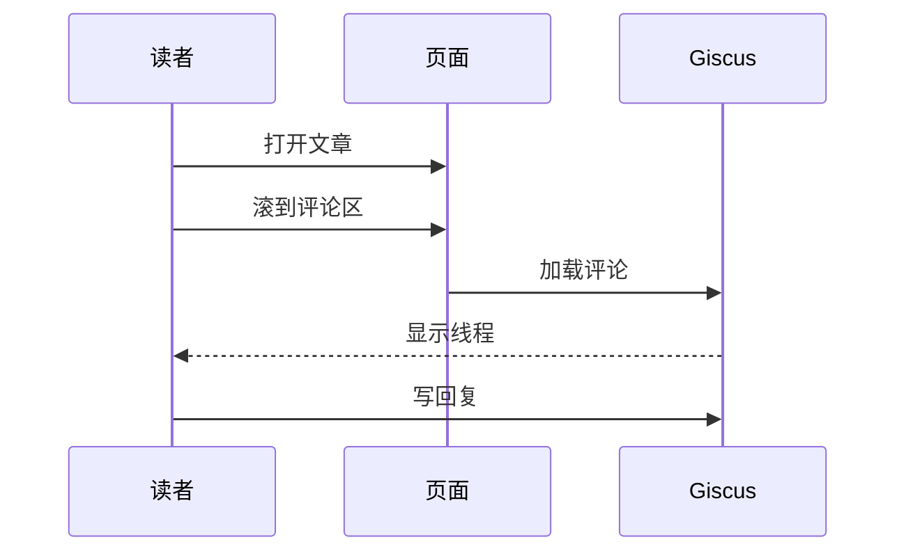
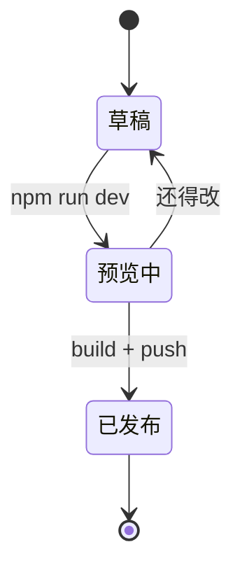
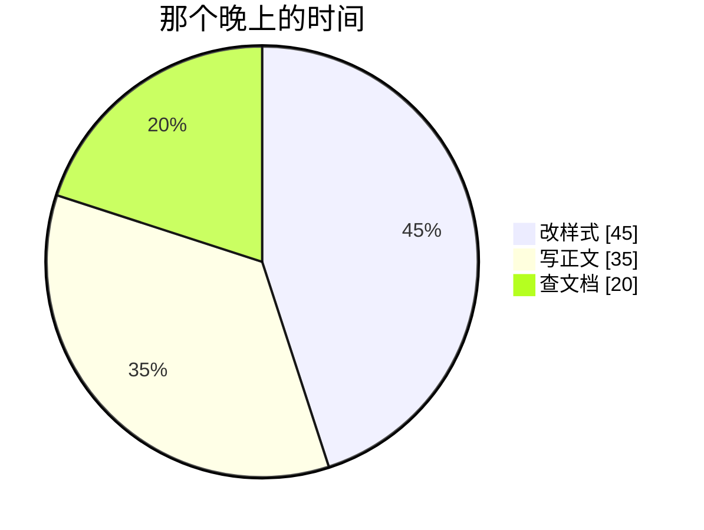

import { Image } from 'astro:assets';
import coverDemo from '../../assets/covers/cover-05.webp';

这篇主要是写给自己看的。某个晚上从有想法到点发布，我把标题、列表、代码、公式和几个 Mermaid 图都试了一遍，以后写文章就不用到处翻文档了。

# 动笔之前

我很少先想「要测 Markdown」，而是先想**今晚要把什么事说明白**：比如 **换主题色**、*某次踩坑*、~~写了一半又划掉的一句~~，或者行内提一嘴 `npm run dev`。

> 动笔前先想：读者看完能带走什么。结构会清楚很多。

Obsidian / GitHub 那套提醒框，这里也能用：

> [!NOTE]
> 页顶已经有封面和大标题了，正文从第一个 `#` 章节接着写就行；它会被渲染成页面上的二级标题。

> [!TIP]
> 预览时样式像没更新，**Ctrl+Shift+R** 硬刷新一下，多半是浏览器缓存。

> [!WARNING]
> 站外链接会新开标签；站内像 [关于页](/about/) 这种就在当前页跳。

## 列提纲

把内容拆块，比边写边改结构轻松：

- 背景：为什么写
- 过程：做了什么
- 结果：现在怎样
- 延伸：还想试什么

有先后顺序就改成有序列表：

1. 在 `src/content/blog/` 新建 `.md` 或 `.mdx`
2. 填 frontmatter（标题、日期、`category`、标签、摘要）
3. 本地 `npm run dev` 预览
4. 满意了再 `npm run build` 推上去

需要分层时可以嵌套：

- 写作
  - Markdown 正文
  - MDX 组件（比如下面的 `<Image>`）
- 发布
  - GitHub Pages
  - 评论走 Giscus

### 今晚的待办

- [x] 封面和摘要想好
- [x] 正文草稿
- [x] 插图、代码、公式都过一遍
- [ ] 发完去喝口水

#### 封面与摘要

封面用的是傍晚窗光那张；日期和字数在标题下面，分类和标签在 meta 行，摘要再下一行。标签可以点进 [标签页](/tags/)。

##### 字数与更新

字数会自动统计；如果后来大改过，可以在 frontmatter 里补 `updatedDate`。

###### 六级标题

很少用到，但层级到底时就是这一档。字号仍可读，不会缩成脚注大小。

# 查资料、贴链接

写技术内容免不了翻文档。站内我常链 [归档](/archives/) 或 [分类](/categories/)；站外常用这些：

- [Astro Markdown 指南](https://docs.astro.build/zh-cn/guides/markdown-content/)
- [CommonMark 说明](https://commonmark.org/)
- [Expressive Code 文档](https://expressive-code.com/)

不写 Markdown 链接语法、直接贴 URL 也行：https://github.com/withastro/astro

# 插图与表格

写两段字之后配张图，眼睛会轻松一点。傍晚窗边那道暖光正好：

<Image src={coverDemo} alt="傍晚窗边的暖色光线" widths={[720, 1080]} sizes="(max-width: 720px) 100vw, 720px" />

几种写法各自适合什么场合：

| 写法 | 适合什么 | 在本站的表现 |
|------|----------|--------------|
| `#` 章节标题 | 正文大段分割 | 页顶已有大标题，正文 `#` 渲染成二级 |
| `[文字](url)` | 站内站外链接 | 外链新开页，带 `noopener` |
| `` / `<Image>` | 插图 | 圆角、细边框；MDX 可指定宽度 |
| 围栏代码块 | 命令、配置 | 语法高亮，右上角可复制 |
| `- [x]` 任务列表 | 待办、清单 | 可勾选样式 |

# 代码、公式与几种图

贴命令或配置时用围栏代码块。高亮跟日/夜主题走，右上角能复制，带 `title` 的会像小文件 tab：

```js title="about-me.js"
const me = {
  name: '星云可可',
  aka: 'NebulaGMY',
  site: '星云可可の小窝',
};

console.log(`${me.name} 正在排版`);
```

终端风格会自动套在 shell 类语言上：

```bash title="本地预览"
npm run dev
# 浏览器打开终端里显示的地址；改样式后 Ctrl+Shift+R 硬刷新
```

节选配置时可以高亮行号：

```js title="astro.config.mjs" {2-4}
export default defineConfig({
  integrations: [expressiveCode(), mdx(), sitemap()],
  markdown: { syntaxHighlight: false },
});
```

行内短命令写进句子就好，比如 `npm run build`；大段逻辑还是单独成块。

偶尔要公式：行内 $E=mc^2$、$a^2+b^2=c^2$；块级适合单独一行：

$$
\int_0^1 x^2 \, dx = \frac{1}{3}
$$

Mermaid 能画的也不止流程图。那晚上我试了下面几种。

从草稿到上线，流程图最直观：



读者滚到底留言，时序大概是这样：



一篇文在脑子里过的阶段，用状态图也好记：



那周排版拆成甘特，就不会拖到周末：


时间花哪儿了，用饼图分一下：



# 脚注与收工

有些说明不想打断正文，就丢脚注[^astro-content]。角标点到底部，再点 ↩ 回来；跳转时会避开顶栏。

[^astro-content]: Astro 内容集合的字段说明见 [官方文档 · Content collections](https://docs.astro.build/zh-cn/guides/content-collections/)。

---

标题层级、引用、提示框、列表、链接、图、表、代码、公式、Mermaid、脚注，常用元素都过了一遍。下面留言区开着，有错字或漏写的元素可以直接说。
